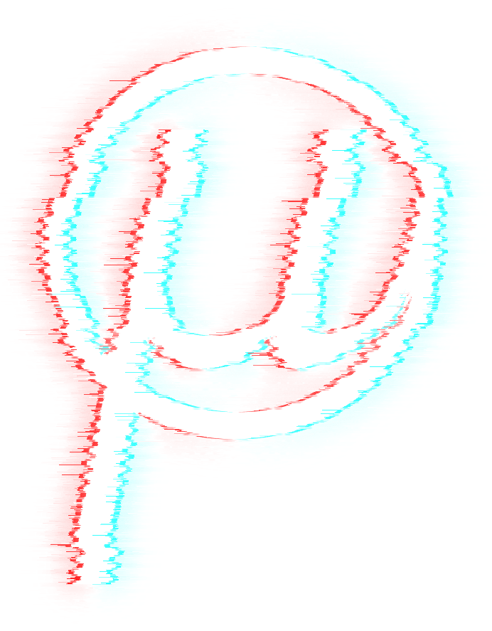
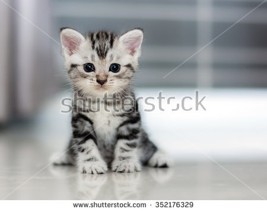
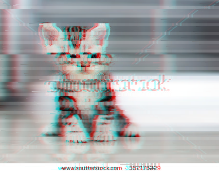

# glitch
Apply glitch effects to images

## Examples
```
glitch render examples/test.png
```



```
glitch render \
    --desync-amp 0 \
    --scan-height 12 \
    --scan-gap 6 \
    --wind-onset 0.01 \
    --wind-continue 0.2 \
    examples/kitten.jpg
````



## Usage
Build with `cargo build --release`.

Show help with `glitch help`, generate completion with `glitch completion`. 

To run: `glitch render [options] <input image>`. The following options are supported:

| Option | Description |
|--------|-------------|
| `-n <N>`, `--number <N>` | Number of images to generate. Subsequent images form a smooth animation |
| `--color-shift <N>` | Offset color channels. The red channel is offset this many pixels to the left, the green/blue channels are offset to the right. A value of 0 disables the effect |
| `--scan-height <N>` | Height of scanlines |
| `--scan-gap <M>` | Height of gap between scanlines. Empty pixels are blurred slightly from pixels above/below. Set to 0 to disable the effect |
| `--desync-amp <N>` | Amplitude of the sinuoid wave of the desync effect. Set to 0 to disable the effect |
| `--desync-freq <M>` | Frequency of the sinuoid wave of the desync effect. |
| `--wind-onset <N>` | Onset chance for the wind effect (stretching single pixels over distance). Set to 0 to disable the effect |
| `--wind-continue <M>` | Continue chance for the wind effect (higher values result in longer streaks) |
| `--blocks <M>` | Number of blocks for the block shift effect. Each block is several consecutive lines that are moved somewhat left or right. Set to 0 to disable the effect. |